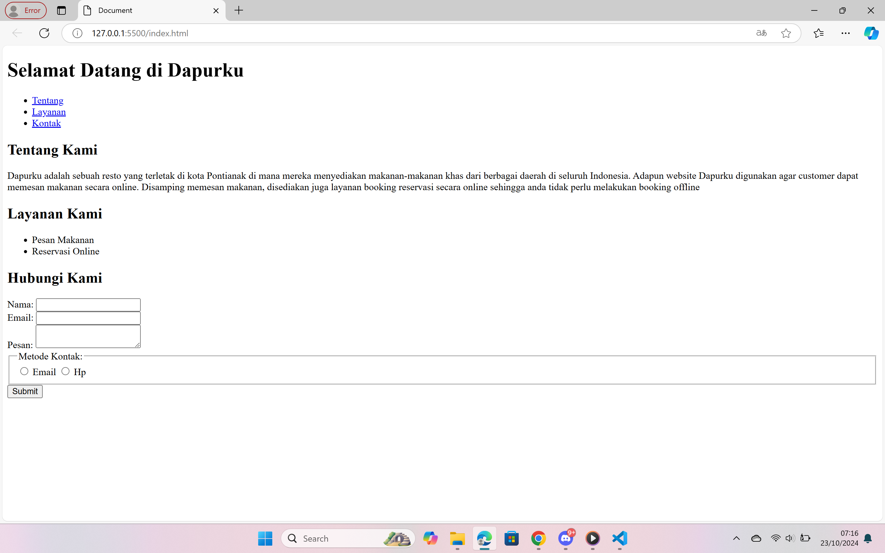

# Dapurku

## Deskripsi

Ini adalah projek website Dapurku yang dikembangkan menggunakan HTML5. Ini berfungsi sebagai pondasi untuk struktur dasar situs web Dapurku dengan menggunakan semantic html.

## Fitur

Adapun fitur pada website sebagai berikut:

- Structur Semantic HTML5
- Navbar
- List Layanan
- Kontak Form dengan variasi input data

## Preview

