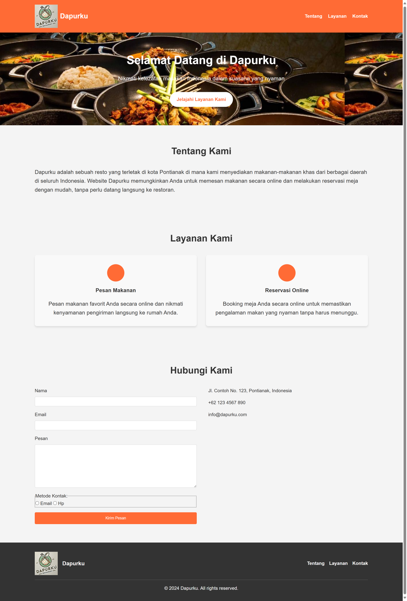

[Dapurku](https://revou-fsse-oct24.github.io/module-1-ridwanam9/)

# Dapurku

## Deskripsi

Ini adalah projek website Dapurku yang dikembangkan menggunakan HTML5. Ini berfungsi sebagai pondasi untuk struktur dasar situs web Dapurku dengan menggunakan semantic html.

## Fitur

Adapun fitur pada website sebagai berikut:

- Structur Semantic HTML5
- Navbar
- List Layanan
- Kontak Form dengan variasi input data

## Bagian

1. **Header**: Berisi logo, nama restoran, dan menu navigasi.
2. **Hero**: Berisi dengan tagline dan tombol Jelajahi layanan kami.
3. **About**: Memberikan informasi tentang Dapurku dan penawarannya.
4. **Services**: Menyoroti layanan utama - pemesanan makanan online dan reservasi meja.
5. **Contact**: Berisi formulir kontak dan informasi kontak restoran.
6. **Footer**: Menampilkan logo, tautan cepat, dan pemberitahuan hak cipta.

## Preview

